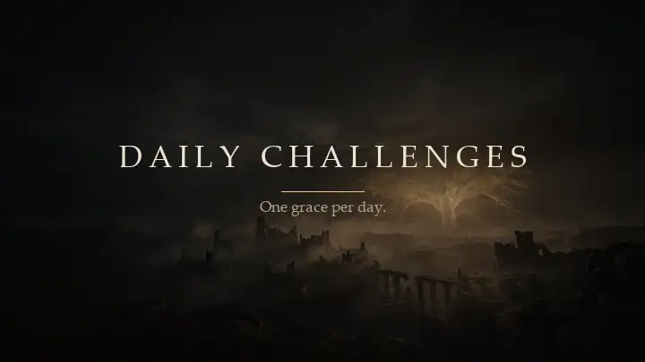
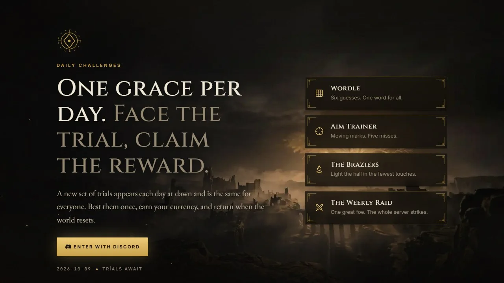
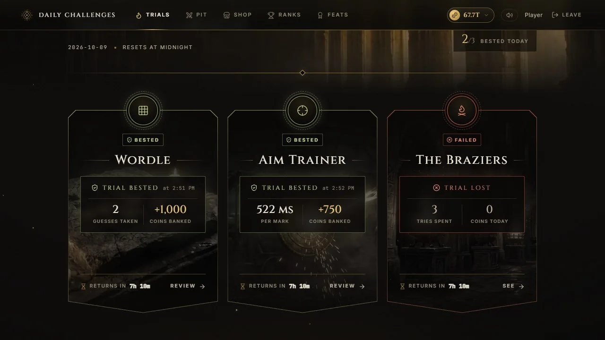
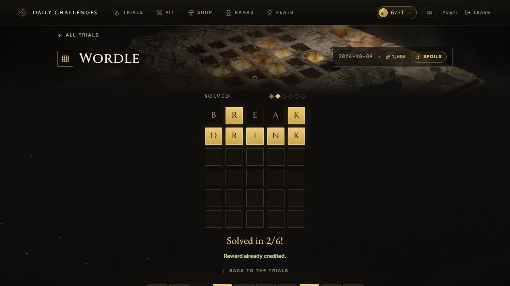
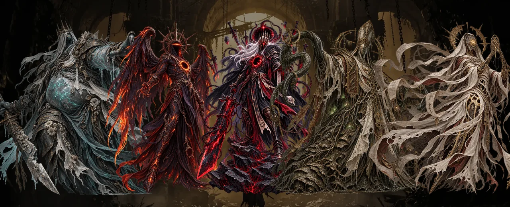
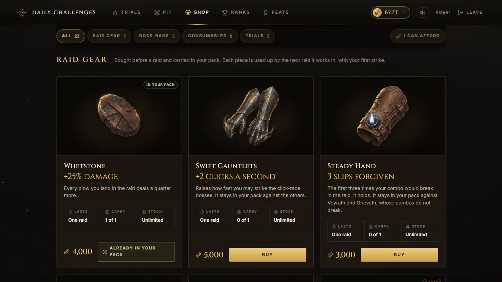
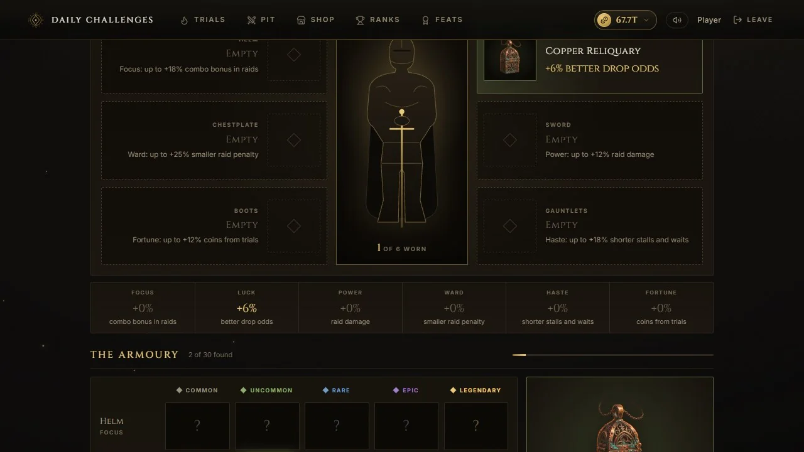
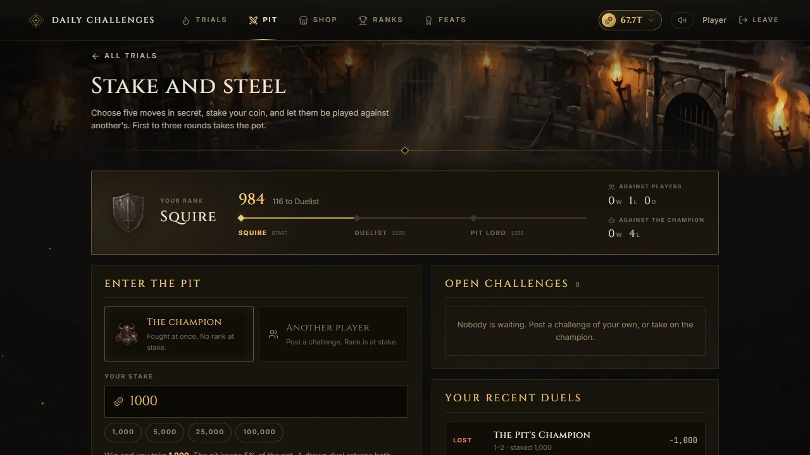
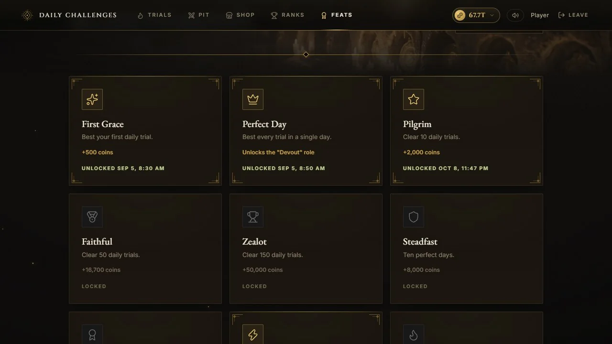

<div align="center">


# Daily Challenges

**One grace per day. Face the trial, claim the reward.**

A self-hosted website of daily skill trials, a weekly raid and a coin economy for a Discord community.

[Live site](https://discord-daily-challenges.vercel.app) · [Features](#features) · [Setup](#setup) · [How it works](#how-it-works)

<br />



</div>

## What it is

Players sign in with Discord and get the same set of trials as everyone else in the server, once a day. Winning pays coins through [UnbelievaBoat](https://unbelievaboat.com), keeps a streak going, and can drop a piece of equipment. Once a week the whole server fights one boss together. Coins are spent in the shop, or staked against other players in the Pit.

The games run entirely on the website. Discord is used for sign-in, and optionally for paying coins and granting roles.

<p align="center">
  
  
</p>

## Features

### Daily trials

Each trial can be won once per player per day, and resets at midnight in the timezone you choose. An admin can switch any of them on or off.

| Trial | How it is played |
| --- | --- |
| **Wordle** | Six guesses at a five-letter word. The same word for everyone that day. |
| **Typing Test** | A paragraph against the clock, with a floor on speed and a limit on mistakes. |
| **Aim Trainer** | Moving targets to clear before the time runs out. |
| **The Litany** | A growing sequence to remember. Bank the prize early, or go on for more and risk it. |
| **The Braziers** | A Lights Out puzzle: light the whole hall in as few touches as you can. |
| **Geometry Dash** | A staked auto-runner with difficulty tiers, each with its own entry cost and payout. |

<p align="center">
  
</p>

### The weekly raid

One boss is drawn from the roster each week, never the same one twice running. Every fighter's damage is counted; if the boss falls, the bounty is split by damage, and if it survives, everyone who fought pays a penalty.

<p align="center">
  
</p>

Each boss is fought differently and rewards a different habit:

| Boss | The fight | What it rewards |
| --- | --- | --- |
| **Veyrath** | A click race | Striking fast without stopping |
| **Grieveth** | A click race | Stopping to draw breath, then landing heavy blows |
| **Nyrrek** | An eclipse that opens and closes | Striking in the dark, never in the light |
| **The Silt Cardinal** | Growths that surface around it | Lancing them in a row without a miss |
| **The Unraveled Saint** | Short trials of typing, aim and memory | Never repeating either of your last two |

### The shop, gear and equipment

<p align="center">
  
  
</p>

- **Raid gear** is carried into a raid and used up by it: more damage, a faster hand, a penalty waived.
- **Boss-bane gear** works against one boss each.
- **Consumables** are used from the arena in the middle of a fight, three to a raid.
- **Trial charms** give a second try at a lost trial, reveal a Wordle letter, or cover a missed day's streak.
- **Equipment** is found, not bought: thirty pieces across six slots and five rarities, dropped by trials and slain bosses. The best piece in each slot is worn automatically.
- **The Reliquary** is a crate that can hold any piece of equipment, or nothing.
- **Discord roles**, permanent or timed, can be sold for coins.

### The Pit

A wagered duel. Both players choose five moves in secret and stake the same amount; the moves are played against each other and the first to three rounds takes the pot. Players can challenge each other or the house champion, and climb a rank ladder.

<p align="center">
  
  
</p>

### Progress

- **Streaks** count consecutive days on which every trial was won, and are ranked on a public leaderboard.
- **Achievements** are one-time feats that pay coins, a permanent reward boost or a Discord role. Anything earned but not yet delivered is settled the next time the player loads a page.
- **A personal record page** shows streak history, a completion calendar, personal bests, equipment and the pack.

### For the server owner

- **Admin panel** for activity, payouts, flagged attempts and support reports, with tabs to tune the games, the shop, the Pit, equipment drops, achievements and the raid roster. Changes apply without a redeploy.
- **Three-step admin access:** a listed Discord account, a password and an authenticator code.
- **Anti-cheat on every scored action.** Scores are worked out on the server, never trusted from the browser, and suspicious attempts are logged for review.
- **Rate limiting** on sign-in, play, purchases and the raid.
- **Dev mode** lets an admin replay the trials without recording results or paying coins.

## Built with

| | |
| --- | --- |
| Framework | Next.js 16 (App Router), React 19, TypeScript |
| Sign-in | Auth.js with Discord |
| Database | PostgreSQL through Prisma |
| Economy | UnbelievaBoat API (optional) |
| Styling | CSS modules; artwork served as WebP; sound effects generated in the browser, no audio files |

## Setup

### Prerequisites

- Node.js 20 or later
- A PostgreSQL database (a free tier from Supabase or Neon is enough to start)
- A Discord application, for sign-in
- Optional: a Discord bot token and an UnbelievaBoat application, for coin rewards and role grants

### 1. Create a Discord application

1. In the [Discord Developer Portal](https://discord.com/developers/applications), create an application.
2. Under **OAuth2**, copy the Client ID and Client Secret.
3. Under **OAuth2 → Redirects**, add the address the site will sign in through. The path must be exact:
   - `http://localhost:3000/api/auth/callback/discord` for local development
   - `https://your-domain/api/auth/callback/discord` for production
4. To let the site grant roles, add a bot to the application, invite it with **Manage Roles**, and place its role above every role it will grant.

### 2. Install

```bash
git clone https://github.com/xReSHo/discord-daily-challenges.git
cd discord-daily-challenges
npm install
```

### 3. Configure

```bash
cp .env.example .env
```

At minimum:

| Variable | Purpose |
| --- | --- |
| `DISCORD_CLIENT_ID`, `DISCORD_CLIENT_SECRET` | From step 1 |
| `AUTH_SECRET` | Session signing secret. Generate one with `npx auth secret` |
| `NEXTAUTH_URL` | The site's own address (`http://localhost:3000` locally) |
| `DATABASE_URL`, `DIRECT_URL` | A pooled connection for queries and a direct one for schema changes |

For the optional parts:

| Variable | Enables |
| --- | --- |
| `UNBELIEVABOAT_API_TOKEN`, `UNBELIEVABOAT_GUILD_ID` | Coin rewards, the shop, the Pit and raid payouts |
| `DISCORD_BOT_TOKEN`, `DISCORD_GUILD_ID` | Role grants from the shop and achievements |
| `ADMIN_DISCORD_IDS` | Comma-separated Discord user IDs allowed into the admin panel |
| `ADMIN_SETUP_KEY` | One-time key for enrolling the admin password and authenticator |
| `BOSS_RESOLVE_SECRET`, `SHOP_FULFILL_SECRET`, `FEEDBACK_SECRET` | Shared secrets for a companion Discord bot |

Every variable is documented in `.env.example`. Each optional integration degrades gracefully when unset: the site still runs and skips that feature.

### 4. Create the database schema

```bash
npx prisma db push
node scripts/seed-boss-roster.mjs   # the five raid bosses
```

### 5. Run

```bash
npm run dev                      # development, http://localhost:3000
npm run build && npm run start   # production
```

### 6. Enrol the admin

Sign in with an account listed in `ADMIN_DISCORD_IDS`, open `/admin/setup`, and enter `ADMIN_SETUP_KEY` to set a password and pair an authenticator app. `node scripts/admin-reset.mjs` clears the enrolment if you lose either.

### Deploying

The site runs on any host that serves a Next.js app. On Vercel, import the repository and add the environment variables; `vercel.json` pins the functions to one region.

- **Keep the host and the database in the same region.** Every request makes several queries, and cross-region latency is paid on each one.
- **Mind the connection limit.** On a serverless host each instance holds its own connection. The example `DATABASE_URL` pins an instance to one connection so a small pooler is not exhausted.
- **Environment changes need a redeploy** to take effect.

## How it works

- **One reward per day, enforced by the database.** A completion row is claimed under a unique constraint before any coins move, so two requests can never both pay out, and a failed payout releases the claim.
- **The server decides every result.** Daily content is derived from a secret seed and the date. The browser sends what the player did; the server replays it and scores it.
- **The raid settles itself.** When a boss's window closes, the next request to the site settles the payout or the penalty. A companion bot can also call `POST /api/boss/resolve` with `Authorization: Bearer <BOSS_RESOLVE_SECRET>` to settle it on time and announce the result.
- **Work after the response.** Achievement checks run after the reply has been sent, using the host's keep-alive hook, so a player never waits on them and a serverless host does not cut them off.

### Offline checks

The rules that move coins are covered by scripts that need no database:

```bash
node --experimental-strip-types --import ./scripts/ts-esm-hook.mjs scripts/verify-raid-gear.mts
```

The same command runs `verify-equipment.mts`, `verify-braziers.mts`, `verify-geodash.mts`, `verify-perfect-days.mts` and `verify-admin-crypto.mts`.

## Companion bot

The site stands on its own. [Discore](https://github.com/xReSHo/discore), a separate Discord bot, adds raid announcements, removal of expired shop roles and a `/report` command that files bug reports into the admin panel.

## Permissions

A bot token is only needed for role grants. That bot needs **Manage Roles** and a role positioned above every role it grants or removes. The site registers no slash commands of its own.
